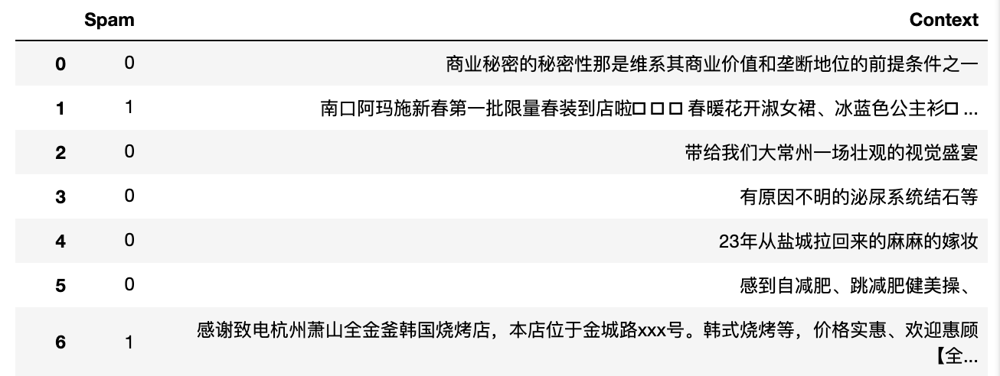

# 实验说明--Lab2

我们生活在一个富媒体的时代，众多繁杂的信息以各种各样的形式涌入到我们日常生活的学习工作之中，可是却同时带来了一个重要的问题——**信息失真**。

它不仅发生在你主动获取信息的过程中——比如说阅读新闻的时候。有可能你赖以获取信息的来源是不真实的，这一类失真的主要特点是**假**；它也可能发生在你被动获取信息的过程中——比如垃圾短信。它让你的信息量变得低效、偏离你获取信息的标的，而这一类失真的主要特点是**杂**。

下面我们将会以**虚假新闻数据集**和**垃圾短信数据集**实现两个数据分析的实例，来看看我们所学到的知识技能能够如何帮助我们解决现实中面临的种种问题。

## 第一部分 倒排索引及词云

### 0.数据格式

随附fake_news.csv是一个谣言新闻数据集，包含两列，第一列为“id”，第二部分为“context”，是新闻标题。 请使用pandas对数据进行观察。

### 1.倒排索引

- 请将以下所有关键词，构建倒排索引：
  - 对比类型的关键词：
      中国，美国，日本
        北京，深圳
        男人/男子，女人
        结婚，离婚
  - 话题有关的关键词：
      农村，网友，孩子，怀孕，
        娱乐圈，耍大牌，
        致癌，健康，食物，减肥，脱发
        真相，死亡，自杀，
  - 标题党的关键词：
      方法，原来，竟然，真的，揭秘，千万，注意，快速，原因，一招
- 测试倒排索引构建是否正确
  - 我们将给出若干关键词集合（如[中国,男人]，[怀孕,一招]），请使用倒排索引找出包含所有关键词的标题ID。
  - 隐藏题为加分项，现场出题演示结果。

### 2.词云

请你选择2个自己感兴趣的关键词或者关键词集合打印词云。

比如 [脱发]

[耍大牌]

## 第二部分 垃圾短信文本分析

### 0.数据格式

随附文件中

- data_train.csv和data_test.csv分别是垃圾短信的训练集和测试集。

- 格式为Spam,Context,分别代表着**是否是垃圾短信**和**文本内容**.如图所示.

  

- 注意！

  - 数据需要预处理
  - 其中有重复项，请考虑如何消除重复项对结果的影响

### 1.建立分类器

通过给定数据集，构造自己的分类器，并在notebook中简要描述算法思想。

### 2.测试集评测

随附文件中data_test.csv可作为自我测评数据集，通过比对分类器输出和每项的Spam得出准确率

### 3.最终评测结果

验收时，会给出一个和data_test.csv格式相同的测试集，检测分类器准确率。